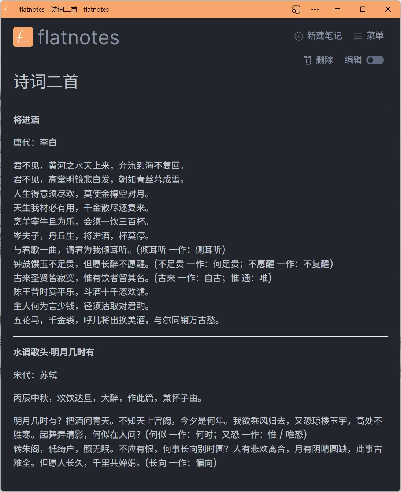
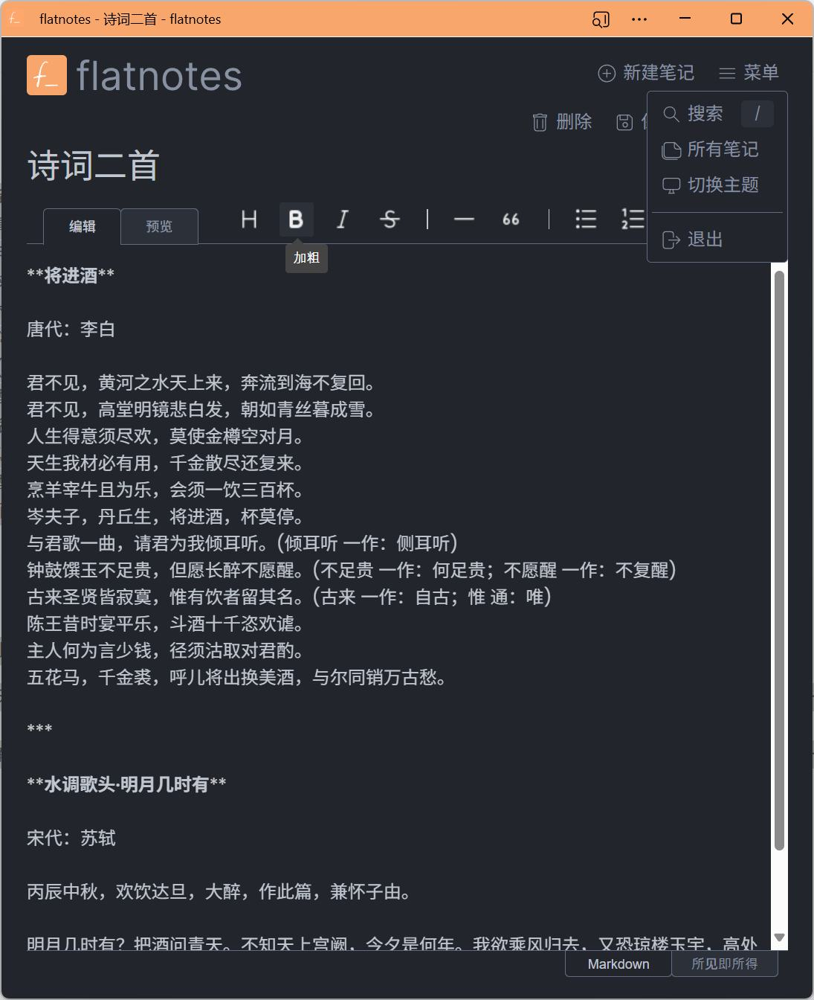
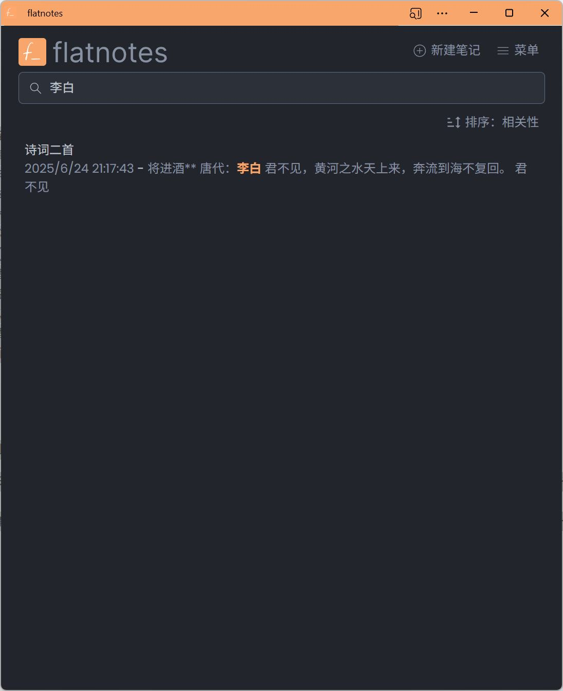

# FlatNotes

一个自托管、无数据库的笔记网络应用程序，利用平面文件夹中的 Markdown 文件进行存储。

- 原项目地址
  - GitHub仓库 https://github.com/Dullage/flatnotes
- 我汉化和构建docker镜像的仓库
  - GitHub仓库 https://github.com/Firfr/flatnotes-zh-cn
  - Gitee仓库 https://gitee.com/firfe/flatnotes-zh-cn
  - DockerHub https://hub.docker.com/r/firfe/flatnotes-zh-cn

## 汉化&修改&镜像制作

如果镜像拉取失败，请B站发私信，或提issues，  
华为云上的镜像仓库默认推送的镜像不是公开的，有可能是我忘记设置公开了。

当前制作镜像版本(或截止更新日期)：5.5.4

首先感谢原作者的开源。  
中文搜索，参考的另一个汉化项目 [https://github.com/jettzhan/flatnotes-zh](https://github.com/jettzhan/flatnotes-zh)

具体汉化了那些内容，请参考[翻译说明](./翻译说明.md)。

欢迎关注我B站账号 [秦曱凧](https://space.bilibili.com/17547201) (读作 qín yuē zhēng)  

有需要帮忙部署这个项目的朋友,一杯奶茶,即可程远程帮你部署，需要可联系。  
微信号 `E-0_0-`  
闲鱼搜索用户 `明月人间`  
或者邮箱 `firfe163@163.com`  
如果这个项目有帮到你。欢迎start。也厚颜期待您的打赏。

如有其他问题，请提`issues`，或发送B站私信。

## 镜像

从阿里云或华为云镜像仓库拉取镜像，注意填写镜像标签，镜像仓库中没有`latest`标签

容器内部端口 8080 可通过设置环境变量`FLATNOTES_PORT`的值来指定监听端口。

- 国内仓库
  - AMD64镜像
    ```bash
    swr.cn-north-4.myhuaweicloud.com/firfe/flatnotes_zh-cn:5.5.4
    ```
- DockerHub仓库
  - AMD64镜像
    ```bash
    firfe/flatnotes_zh-cn:5.5.4
    ```

## 部署

### docker run 命令部署

```bash
docker run -d \
--name flatnotes_zh-cn \
--network bridge \
--restart always \
--log-opt max-size=1m \
--log-opt max-file=1 \
-p 端口:8080 \
-e FLATNOTES_SECRET_KEY="aLongRandomSeriesOfCharacters" \
-e FLATNOTES_AUTH_TYPE=password \
-e FLATNOTES_USERNAME="用户名" \
-e FLATNOTES_PASSWORD="密码" \
-v 数据目录:/data \
swr.cn-north-4.myhuaweicloud.com/firfe/flatnotes_zh-cn:5.5.4
```

### compose 文件部署 👍推荐

```yaml
#version: '3'
name: flatnotes_zh-cn
services:
  flatnotes_zh-cn:
    container_name: flatnotes_zh-cn
    image: swr.cn-north-4.myhuaweicloud.com/firfe/flatnotes_zh-cn:5.5.4
    network_mode: bridge
    restart: always
    logging:
      options:
        max-size: 1m
        max-file: '1'
    environment:
      TZ: Asia/Shanghai
      TIME_ZONE: Asia/Shanghai
      FLATNOTES_SECRET_KEY: "aLongRandomSeriesOfCharacters"
      FLATNOTES_AUTH_TYPE: password
      FLATNOTES_USERNAME: "用户名"
      FLATNOTES_PASSWORD: "密码"
    ports:
      - 端口:8080
    volumes:
      - 数据目录:/data
```

## 效果截图

| 笔记 | 编辑 | 搜索 |
| :-: | :-: | :-: |
|  |  |  |


